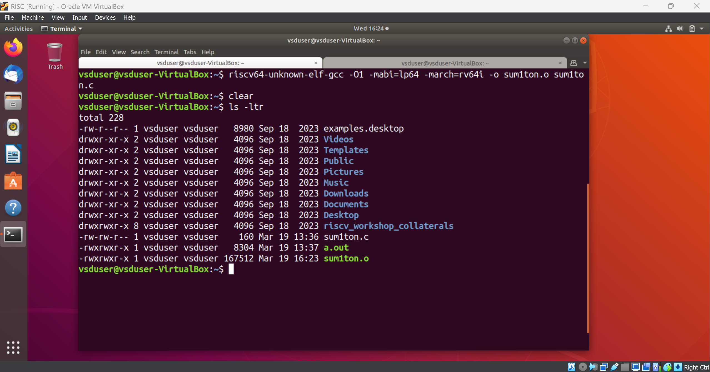
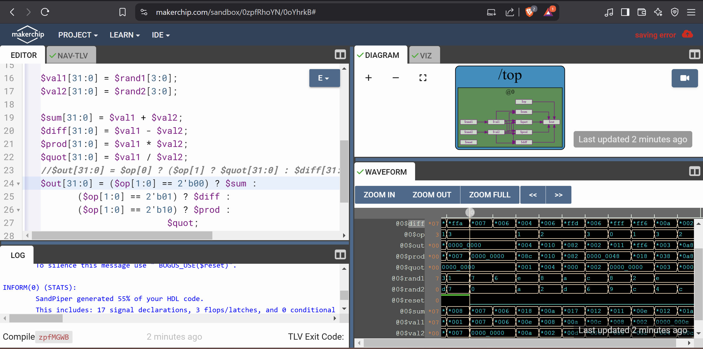

# RISCV-MYTH
workshop on RISCV ISA using OpenSource tools

# DAY-1 - Introduction to RISC-V ISA and GNU compiler toolchain

## C-program to compute sum from one to n

Open your linux and nagivate to the ternimal

Open your prefered text editor and write the C program code to compute the sum of N numbers.


Now, Run it using GCC command


Next step is to use the RISCV complier run the c code and look at the assembly code.
First we use the below command to run the code

```
riscv64-unknown-elf-gcc -o1 -mabi=lp64 -march=rv64i -o sum1ton.o sum1ton.c
```


This converts the code into assembly language.

```
riscv64-unknown-elf-objdump -d sum1ton.o | less
```


Now, change the complier command and observe the number of instructuons taken to run the same code.

```
riscv64-unknown-elf-gcc -ofast -mabi=lp64 -march=rv64i -o sum1ton.o sum1ton.c
```


We can observe that here, it has taken 12 instructions to run the main fucntion compared to 15 instructions using the -o1 in the complier command.


Next step is to use SPIKE to run the object file we created to get the output of the C program. Use  the below command for that
```
spike pk sum1ton.o
```


We can also run each instruction manually. For that we fiest enter the manual control using SPIKE with the below command
```
spike -d pk sum1ton.o
```

Then we run the program counter til the first instruction using the below command
```
until pc 0 100b0
```

From there we can manually run the program by going through each instruction just by pressing enter in the keyboard.

You can also view the conents in the resgisters using the below command 
```
reg 0 a2
```
Here a is the register.

Below we have used certain SPIKE commands to show the contents in specific registers.


## C Code for highest and lowest signed and unsigned numbers


Now we run it using the RISCV ISA based compiler

```
riscv64-unknown-elf-gcc -ofast -mabi=lp64 -march=rv64i -o intg.o integers.c
```
```
spike -pk intg.o
```


# DAY-2 - Re-writing the C program using ASM language

First we modify the C code to get the sum of numbers as below.


Then we write an Assembly language program for the same code as below.


Now we run the C code using RISCV ISA with GCC complier.


## Converting C code to HEX format

Next, we convert the c code to hex format using the below shell script code and pass it to the picorv32 core for computation.
For this first nagivate to the labs folder inside the riscv_workshop_collateral folder.

Use the below command to view the script
```
cat rv32im.sh
```


Now use the below commands to execute the script

```
chmod 777 rv32im.sh

./rv32im.sh
```


# DAY-3 - Digital Logic with TL-Verilog and Makerchip

## Introduction

**TL-Verilog** (Transaction-Level Verilog) is an extension of SystemVerilog designed to simplify hardware design by introducing transaction-level modeling concepts directly into RTL development. It helps reduce complexity, improve reusability, and enhance productivity by incorporating pipeline-driven design principles.

**Makerchip** is an online IDE that provides an interactive, cloud-based environment for TL-Verilog-based development by RedWood EDA.

Below is an example of the interface of makerchip platform.


## Combinational circuits

- A combinational circuit is a type of digital circuit in which the output depends only on the current inputs and not on any past inputs. Basic logic gates such as not gate, or gate , and gate, etc. are examples of combinational cirtuit.

Here we have a TL-verilog example of a not gate


- Next we use vectors using TL-verilog . Below is an example .


- Implementation of a multiple bit <ins>**MUX**</ins> using TL-verilog in makerchip platform.


- <ins>**Combinational calculator implementation.**</ins> [Sandbox](https://makerchip.com/sandbox/0zpfRhoYN/0oYhrkB#)



## **Sequential circuits**

A sequential circuit is a type of digital circuit where the output depends not only on the current inputs but also on past inputs (i.e., it has memory)

#### Lab 
- <ins>**32 bit counter**</ins> [ [Sandbox](https://makerchip.com/sandbox/0n5fGhmRZ/0nZh7Qz) ]


- <ins>**Sequential Calculator**</ins> [ [Sandbox](https://makerchip.com/sandbox/0n5fGhmRZ/0nZh7Qz) ]


## **Pipelining**

Pipelining is a design technique used to improve performance by dividing a task into multiple stages, where each stage operates in parallel. It allows for higher throughput by processing multiple instructions or data elements simultaneously.

<ins>**lab-1- Recreating the pipelined logic**</ins> [ [Sandbox](https://makerchip.com/sandbox/0G6fJhk2x/0P1hKqp) ]


